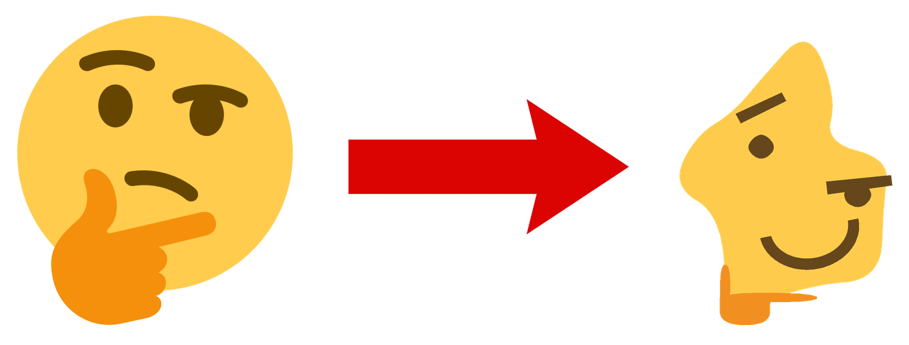

<div align="center">

# Thonk



Tired of the same old thinking emoji? Here's an infinite supply of new ones.

</div>

## Purpose

Generates unique thinking emojis with completely randomized features.


```python
from thonk import generate_thonk

img = generate_thonk(seed=42)
img.save("thonk.png")
```

Same seed always produces the same image. Different seeds produce wildly different results.

## Installation

```
pip install thonk
```

Requires Python 3.8+ and Pillow (installed automatically).

## Usage

```python
from thonk import generate_thonk

# Returns a PIL Image in RGBA mode
img = generate_thonk(seed=42)

# Output size in pixels (default 512)
img = generate_thonk(seed=42, output_size=1024)

# Seeds can be any hashable value
img = generate_thonk(seed="thonk")

# Save, encode, display
img.save("thonk.png")
img.save("thonk.webp")
img.show()
```

## How it works

Each image is built from a set of randomized polygon features - face, eyes, mouth, eyebrows, and hand - smoothed with Chaikin's algorithm and composited in order onto a transparent canvas.

- **Face** - An irregular blob whose points are pushed outward from center by a random amount, controlled by a spikiness value.
- **Eyes** - Placed at random positions inside the face (or a 1/20 chance to be placed outside), using the same blob construction with a lesser spikiness range.
- **Mouth** - One of five moods: neutral (rectangle), open smile/frown (Bézier curve), or closed smile/frown (a filled ellipse arc).
- **Eyebrows** - Thick angled strokes above each eye; if the eyes are close in height, they're merged into a unibrow instead.
- **Hand** - Three smoothed rectangles (thumb, finger, palm) placed at the lowest point of the face, randomly rotated and scaled.
- **Bridging** - If eyes or mouth land outside the face, they get their own blob to sit on, connected back to the face with a generated bridge shape.

Everything is rendered at 2x the target resolution and downsampled with a Lanczos filter for smooth edges.
